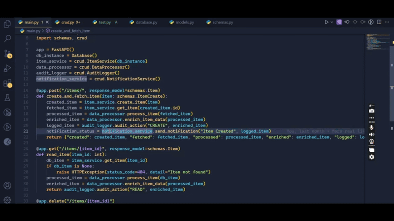

# functra - Function Flow Visualizer

functra is a powerful VS Code extension designed to **visualize function flow** within your codebase. It allows developers to track the execution of API functions and custom-made functions from start to end in an interactive **graph-based view**. With built-in search functionality, you can quickly find and explore specific functions within complex code structures.

---

## Demo

## ✨ Features

✅ **Graph-Based Function Flow Visualization**  
Visualize the flow and dependencies between functions in your code using an interactive **graph**, making it easier to understand execution order.

✅ **Search & Highlight Functions**  
Easily find and highlight any function in the graph with a quick search.

✅ **Supports Custom Functions**  
Captures **user-defined** functions, giving you a complete picture of function interactions.

✅ **Lightweight & Fast**  
Optimized for performance, enabling smooth interaction even with large codebases.

✅ **Download Graph as PNG**  
Export the visualized graph as a **PNG image**, now with **timestamped filenames** for better organization.

✅ **Loading Indicator**  
Displays a **loading spinner** during initialization for better user feedback.

✅ **Optimized for Python and FastAPI**  
Specifically designed to work seamlessly with **Python** and **FastAPI** projects. Experimental support for other languages is available and may vary in stability.

## Installation

1. Open **VS Code**
2. Go to the **Extensions** Marketplace (`Ctrl+Shift+X` / `Cmd+Shift+X` on Mac)
3. Search for **functra**
4. Click **Install**
5. Enjoy seamless function visualization!

---

## Usage

1. Open your project in VS Code.
2. Select a function **without parentheses**.
3. Right-click and choose **`functra`** from the context menu.
4. The extension will analyze your code and generate a **graph-based function flow**.
5. Use the **search bar** to find specific functions.
6. Double Click on a function node to view its details / Definition.
7. Click on **Download** to Download the Flowchart in the form of PNG.

---

## Requirements

- **VS Code v1.65+**
- **Node.js (Optional, for enhanced processing speed)**

---

## Extension Settings

functra contributes the following settings:

- `functra.enable`: Enable/disable functra.

---

## Known Issues

- Large projects may take a few seconds to process.
- Some dynamically generated functions may not appear.

If you encounter any issues, please report them on our [GitHub Issues](https://github.com) page.

---

## Contributing

We welcome contributions! If you'd like to improve functra, feel free to submit a PR on [GitHub](https://github.com/).

Made with ❤️ by Abhishek Sharma and Prem Kothawle
---

## License

[MIT License](LICENSE)

---

**Enjoy using functra? Give us a 5⭐ on VSCode Market Place and ⭐ on GitHub!** 🚀

